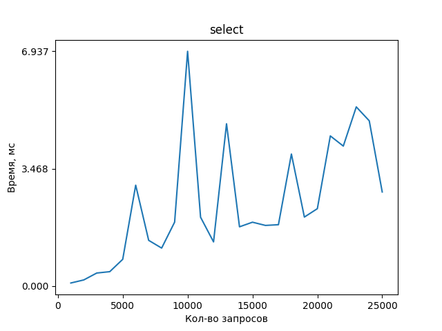
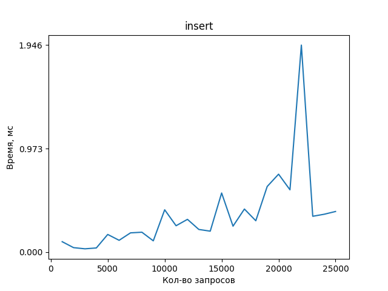
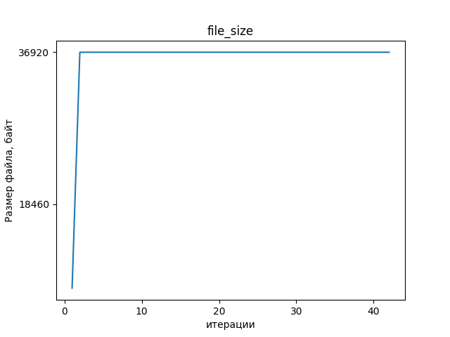
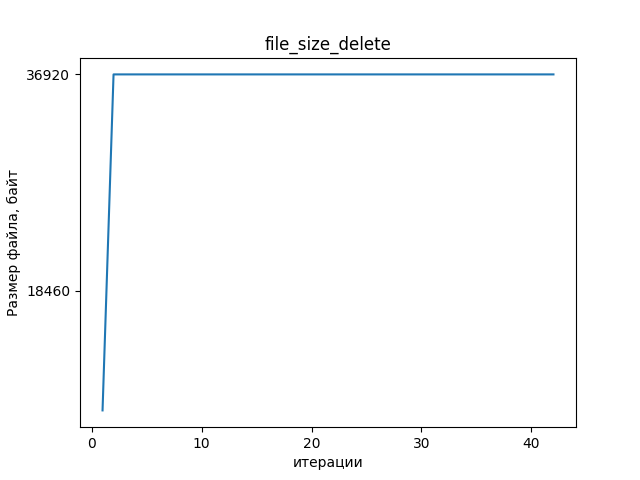

# Низкоуровневое программирование
## Лабораторная работа 1
 Вариант 5: Реляционные таблицы

### Зависисмости
- gcc
- CMake 3.16 и выше
###  Сборка

Linux:
```
cmake .
make
```

Windows:
```
cmake .
nmake
```

### Запуск
`./llp-lab1-tests`

### Цели
Создать модуль, реализующий хранение в одном файле данных (выборку, размещение и гранулярное
обновление) информации общим объёмом от 10GB соответствующего варианту вида.

### Задачи
- Спроектировать структуры данных для представления информации в оперативной памяти
    - Для порции данных. Поддержать тривиальные значения по меньшей мере следующих типов: цетырёхбайтовые целые числа и числа с плавающей точкой, текстовые строки произвольной длины, булевские значения
    - Для информации о запросе
- Спроектировать представление данных с учетом схемы для файла данных и реализовать базовые операции для работы с ним:
    - Операции над схемой данных (создание и удаление колонок)
    - Базовые операции над элементами данных в соответствии с текущим состоянием схемы (над записями заданного вида)
        - Вставка элемента данных
        - Перечисление элементов данных
        - Обновление элемента данных
        - Удаление элемента данных
- Используя в сигнатурах только структуры данных из п.1, реализовать публичный интерфейс со следующими операциями над файлом данных:
    - Добавление, удаление и получение информации о элементах схемы данных, размещаемых в файле данных, на уровне, соответствующем виду записей
    - Добавление нового элемента данных определённого вида
    - Выборка набора элементов данных с учётом заданных условий и отношений со смежными элементами данных (по свойствам/полями/атрибутам и логическим связям соответственно)
    - Обновление элементов данных, соответствующих заданным условиям
    - Удаление элементов данных, соответствующих заданным условиям

- Реализовать тестовую программу для демонстрации работоспособности решения

### Описание работы:

Вся программа разделена на модули - работа с файлами, промежуточное представление, кэш, пользовательский интерфейс. Весь файл поделен на страницы фиксированного размера 4096 байт. В начале файла размещен заголовок файла, в котором содержится необходимая базе метаинформация, в начале каждой страницы размещен заголовок, в котором содержится некоторая метаинформация о ней. 
### Структуры
```c
struct FileHeader {
    struct PossibleValue tableOfTables; // номер страницы, где лежит информация о всех созданных таблицах
    struct PossibleValue tableOfColumns; // номер страницы, где лежит информация о колонках в созданных таблицах
    struct PossibleValue freePages; // начало списка пустых страниц
    size_t next_table_id; // id который нужно присвоить следуюзей таблице
};
```

```c
struct PageHeader {
    struct PossibleValue nextPage; // Номер следующей страницы, принадлежащей этой же таблице
};
```

```c
struct Page {
    struct PageHeader* header; // заголовок страницы
    uint8_t* data; // Данные страницы, вклчюая заголовок
    bool isDirty; // Флаг, была ли страница изменена после считывания
};
```

```c
struct Constant {
    enum DataType type; 
    union {
        int64_t intVal;
        float floatVal;
        bool boolVal;
        char* stringVal;
    } value;
};

struct Condition {
    char* fieldName;
    struct Constant constant;
    enum CompareOperator operator;
};

struct Predicate {
    struct LinkedList* conditions;
};

struct SelectQuery {
    char* from;
    struct Predicate* predicate;  
};

struct InsertQuery {
    char* into;
    struct LinkedList* values;
};

struct DeleteQuery {
    char* from;
    struct Predicate* predicate;
};

struct UpdateQuery {
    char* table;
    struct Condition* condition;
    struct Predicate* predicate;
};
```

### Аспекты реализации
Основной элемент - это Scanner. Его базовая версия последовательно итерируется по всем записям, принадлежащим одной таблице. Переход к следующей записи происходит путем вызова функции next(). Сам сканнер итерируюется по страницам, внутри него лежит pageRecord, который последовательно итерируется по записям на страницы. Сами записи расположены непоследовательно. Перед каждой записью есть один байт, который говорит о наличии этой записи. При выполнении Select запроса, сканнер ищет существующие записи, при выполнении insert сканнер, наоборот ищет пустые записи. Если при вставке нового элемента ни на одной странице не нашлось места, то происходит создание новой страницы. Чтобы минимизировать количество обращений к диску, был создан кэш. Все страницы запрашиваются из кэша и все изменения вносятся так же в кэш и в файл записываются, только при выгрузке страницы из кэша.

Схемы таблиц с метаинформацией

Таблица со всеми таблицами:

`| name | first_page | record_size | id |`

Таблица со всеми колонками:

`| name | table_id | offset | length | length | type |`

### Результаты




Размер файла при удалении таблиц

Размер файла при удалении записей в таблице


### Выводы
В результате выполнения лабораторной работы был разработан модуль, реализующий хранение в одном файле данных в виде реляционных таблиц, объем которых может достигать 10GB. Модуль поддерживает операции select, insert, update, delete. Модуль может работать под управлением ОС семейств Windows и *NIX.